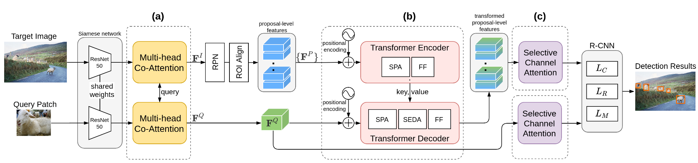

# One-shot object detection methods

## 0. Datasets

COCO, PASCAL

Logs from roboflow: https://universe.roboflow.com/jc-pardo-medina/logs-urqa8
Pipes from roboflow: https://universe.roboflow.com/stanns-college-of-engineering-and-technology/pipes-counting

## 1. Review

**Summary table**
| Method \ Dataset | PASCAL VOC | COCO | GroZi-3.2k | INSTRE-S2 | Logs-roboflow | Pipes-roboflow |
|------------------|------------|------|------------|-----------|------|-------|
| BHRL             | 73.8       | 25.6 |            |           |      |       |
| SiamMask AIT     | 72.2       | 24.3 |            |           |      |       |
| Co-att & exc     | 63.8       | 22.0 |            |           |      |       |
| OWL-VIT          |            | 41.8 |            |           |      |       |
| OS2D             |            |      | 86.1       | 79.5      | 1.8% |       |

**Balanced and Hierarchical Relation Learning for One-shot Object Detection, CVPR 2022**

https://github.com/hero-y/bhrl

Main ideas: 
- multi-level relation module IHR ( Instance-level Hierarchical Relation). It learns relation representation to highlight the complex interdependencies for query and target pairs in a hierarchical manner. Three relation levels: contrastive (between global query feature and the local target featur), salient, attention (for learning more detailed local relation)
-  Ratio-preserving loss (RPL) to solve the imbalance issue of positive-negative samples for achieving balanced and effective learning of the IHR module. It dynamically increases the weight of positive samples and decrease the weight of negative samples to retain a suitable and specific number-weighted ratio (neither too big nor too small). The too-small ratio makes the model difficult to learn from positive samples, while the too-large ratio causes overfitting. Moreover, to enhance the learning of false positives, we separate false positives from negative samples. Then, we take false positives and positive samples as a whole to increase their weights and decrease the weights of true negatives

The architecture of the proposed method</img>

Metrics:
- PASCAL unseen: 73.8% AP
- COCO unseen: 25.6% AP

_________

**SiamMask, FOC OSOD, AIT (Adaptive image transformer for one-shot object detection. CVPR, 2021)**

https://openaccess.thecvf.com/content/CVPR2021/papers/Chen_Adaptive_Image_Transformer_for_One-Shot_Object_Detection_CVPR_2021_paper.pdf

Source code: not found

Main ideas:
- Two-stage technique is used that relies on the region proposal network (RPN) to generate candidate regions. The original RPN is trained without access to any examples from the unseen object classes, and thus could degrade the detection performance in inference due to excluding some legitimate region proposals for a given one-shot query. In dealing with this issue, multi-head co-attention (MCA) is proposed to correlate the target image and query patch through various embeddings. The attention mechanism jointly considers the target image and the query by exploring different aspects of visual characteristics and spawns a corresponding feature map that encode such relatedness, upon which the RPN could generate more relevant region proposals to the query
- Adaptive Image Transformer (AIT) is proposed to explore how each proposal-query pair shares common semantic attributes over the deep visual features. AIT would adaptively transform the feature map of each proposal to match the query feature via employing the learned attention mechanisms
- Selective channel attention for better proposal ranking (enhancing the importance of channels of high similarity before evaluating a proposal-query pair) (ranking loss)

The architecture of the proposed method.  (a) Multi-head Co-Attention (MCA). (b) Adaptive Image Transformer (AIT). (c) Selective Channel Attention (SCA). In AIT, SPA: Selective Parallel Attention; FF: Feed Forward; SEDA: Selective Encoder-Decoder Attention, which replaces the original encoder-decoder attention with the intra-coder SPA.</img>

Metrics: 
- PASCAL unseen: 72.2% AP
- COCO unseen: 24.3% AP

______________________

**One-shot object detection with co-attention and co-excitation. NeurIPS, 2019**

https://github.com/timy90022/One-Shot-Object-Detection

Main ideas:
- Non-local object proposals:  enrich feature maps of interest with the non-local operation: use weighted/attended features between target image and the query patch to improve region proposals quality
- Squeeze and co-excitation to emphasize those feature channels that play crucial roles in evaluating the similarity measure (query can flexibly match a candidate proposal by adaptively re-weighting the importance distribution over all channels)
- Proposal ranking:  two-layer MLP network and margin-based ranking loss (encourage most relevant proposals to the query to appear in the top portion of the ranking list)
        
The architecture of the proposed method</img>

Metrics:
- PASCAL unseen: 63.8% AP
- COCO unseen: 22.0% AP

______________________

**Towards improving classification power for one-shot object detection. Neurocomputing, 2021**

https://www.sciencedirect.com/science/article/abs/pii/S0925231221006949

Code: not found

Main ideas:
- It is shown that a large number of false positives is one of the reasons for the limited performance in the OSOD task
- To solve it, classification Feature Deformation-and-Attention (CFDA) module is proposed to obtain the high-quality query and target features in spatial and channel axis.
- Split Iterative Head (SIH) is proposed to improve the ability to classify similarity between feature generated by CFDA. 

Metrics:
- PASCAL unseen: 71.0% AP
- COCO unseen: 17.5% AP

_____________________

**Simple Open-Vocabulary Object Detection with Vision Transformers (OWL-VIT), ECCV, 2022**

https://github.com/ngthanhtin/owlvit_segment_anything

Main ideas:
- Large model and extensive image-text pre-training (text-conditioned object detection). Can perform one-shot object detection without modifications by using image-derived instead of text-derived embeddings as queries: supply image- instead of text-derived embeddings as queries to the classification head without modifying the model.
- Contrastively pre-train image and text encoders on large-scale image-text data
- Use Vision Transformer as the image encoder

The architecture of the proposed method</img>

Metrics:
- COCO: 41.8% AP

Advantages: 
 
 - text and image queries
 - pre-training on large image-text examples - better generalization properties

**OS2D: One-Stage One-Shot Object Detection by Matching Anchor Features**

https://github.com/aosokin/os2d

Main ideas:

- extracting local features from both input and class images
- correlation matching of features
- spatially aligning features according to successful matches
- computing the localization bounding boxes and recognition score

Metrics:
-  GroZi-3.2k: 86.1% mAP
-  INSTRE-S2: 79.5% mAP

## Examples for OWL-VIT

**Logs**:

Query</img>

Target 1 and detected object</img>

Target 2 and detected object</img>

**Pipes**:

Query</img>

Target 1 and detected object</img>

## Examples for OS2D

**Logs**:

Query</img>

Target 2 and detected object</img>

**Market shelf**:

Query</img>

Detected object - lipton tea</img>

Query</img>

Detected objects - tess tea</img>
